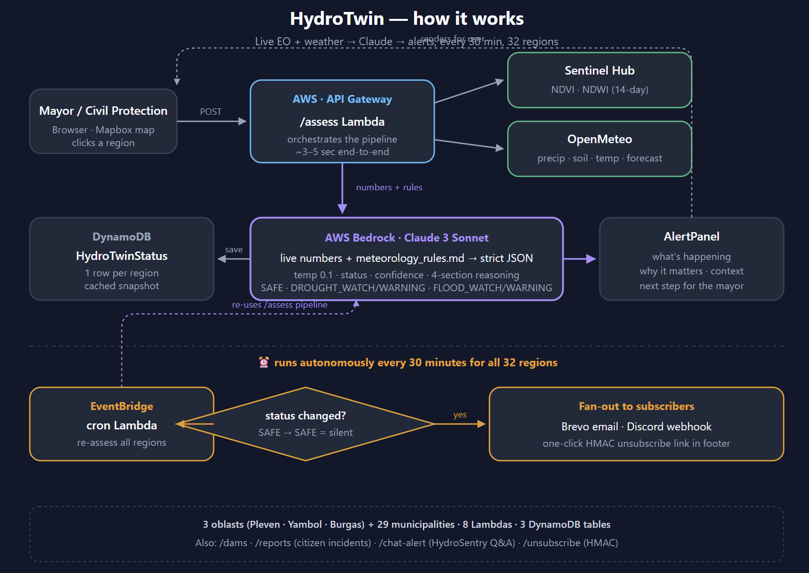

<div align="center">

# 💧 HydroTwin

### Flood & Drought Early-Warning System for Bulgarian Municipalities

**Live Copernicus Sentinel + OpenMeteo → Claude on AWS Bedrock → Email & Discord alerts**
**32 regions · checked every 30 minutes · fully autonomous**

> _"NIMH delivers the warning. bg-ALERT delivers the alarm._
> _**HydroTwin delivers the decision.**"_

🇧🇬 CASSINI Hackathon Bulgaria 2026 · Sofia · 25–27 April

</div>

---



---

## 📋 Table of Contents

- [🌊 What HydroTwin Does](#-what-hydrotwin-does)
- [🎯 Why It Matters](#-why-it-matters)
- [✨ Key Features](#-key-features)
- [🏗️ Architecture at a Glance](#%EF%B8%8F-architecture-at-a-glance)
- [🛰️ Live Data Sources](#%EF%B8%8F-live-data-sources)
- [🤖 The AI Layer](#-the-ai-layer)
- [🗺️ Monitored Regions](#%EF%B8%8F-monitored-regions)
- [📡 Backend — 8 AWS Lambdas](#-backend--8-aws-lambdas)
- [🗄️ Databases — 3 DynamoDB Tables](#%EF%B8%8F-databases--3-dynamodb-tables)
- [🖥️ Frontend Routes](#%EF%B8%8F-frontend-routes)
- [🛡️ Why the Demo Never Breaks](#%EF%B8%8F-why-the-demo-never-breaks)
- [⚙️ Tech Stack](#%EF%B8%8F-tech-stack)
- [🚀 Quick Start (Local Dev)](#-quick-start-local-dev)
- [☁️ Deploy to Production](#%EF%B8%8F-deploy-to-production)
- [🔐 Environment Variables](#-environment-variables)
- [👥 Team](#-team)
- [📂 Repository Layout](#-repository-layout)

---

## 🌊 What HydroTwin Does

HydroTwin is a **decision-support layer** sitting between national meteorology and emergency activation. It pulls live Earth Observation and weather data, asks an AI to reason about it against expert-calibrated thresholds, and tells a mayor in plain language **what to do today**.

```
👤 Mayor clicks region  ─►  3 seconds later  ─►  📊 Risk assessment
                                                  📖 Plain-language reasoning
                                                  🎯 Concrete next step
```

And it does it **autonomously, 24/7**: every 30 minutes, an EventBridge cron re-assesses all 32 regions and fires personalized email + Discord alerts to subscribers the moment a region transitions out of `SAFE`.

---

## 🎯 Why It Matters

| Today's pain | HydroTwin's answer |
|---|---|
| 🌫️ Raw EO data is unreadable for non-experts (NDVI / SAR / SPI-3) | 🗣️ Claude translates it into plain Bulgarian-municipality language |
| 📊 Static dashboards require humans to keep watching | ⏰ Autonomous 30-min cron — alerts come to you |
| 📨 Generic broadcast warnings | 📍 Per-region subscriptions, fan-out only on **state changes** |
| 🐌 NIMH bulletin → bg-ALERT activation has a decision gap | 🧠 HydroTwin fills that gap with AI-grounded recommendations |

---

## ✨ Key Features

- 🛰️ **Live Sentinel-2 NDVI + NDWI** from Copernicus Data Space (cloud-filtered)
- 🌦️ **OpenMeteo** 30-day precipitation, soil moisture, temperature, 24h forecast
- 🧠 **AWS Bedrock + Claude 3 Sonnet** — strict-JSON, temperature 0.1, 4-section reasoning
- 🇧🇬 **3 oblasts + 29 municipalities** = 32 regions on a Mapbox satellite map
- ⏰ **Autonomous 30-min cron** — re-assesses everything, fires only on transitions
- ✉️ **Brevo email + per-user Discord webhooks** — multi-channel subscriptions
- 🔐 **HMAC-signed one-click unsubscribe** — no login needed
- 🚧 **Bulgarian dam monitoring** (Kardzhali · Studen Kladenets · Ivaylovgrad) with NDWI correlation
- 📝 **Citizen incident reports** — close the loop with public submissions
- 💬 **HydroSentry chat assistant** — Q&A scoped to the active alert (max 3 sentences)
- 🛡️ **Demo-mode fallbacks at every layer** — the demo literally cannot break

---

## 🏗️ Architecture at a Glance

The diagram at the top of this README shows the live request path (top half) and the autonomous loop (bottom half).

**Live click path** — a user clicks a region on the map:

```
Browser ──POST──► API Gateway ──► /assess Lambda
                                    ├──► Sentinel Hub (NDVI · NDWI)
                                    ├──► OpenMeteo (precip · soil · temp · forecast)
                                    └──► Bedrock (Claude 3 Sonnet)
                                          + meteorology_rules.md
                                          ↓
                                    DynamoDB · HydroTwinStatus
                                          ↓
                                    AlertPanel renders 4-section reasoning
```

**Autonomous loop** — every 30 minutes, for all 32 regions:

```
EventBridge cron ──► re-runs /assess pipeline ──► writes snapshot
                                                       ↓
                                              status changed?
                                                  ├─ SAFE → SAFE  ⇒ silent
                                                  └─ any transition ⇒ fan out
                                                       ↓
                                                  ✉️ Brevo email + 💬 Discord
                                                  (HMAC unsubscribe in footer)
```

---

## 🛰️ Live Data Sources

| Source | Provider | What we pull | Window |
|---|---|---|---|
| 🛰️ Sentinel-2 L2A NDVI | Copernicus Data Space (Sentinel Hub Statistical API) | Vegetation health (B4/B8) | 14 days, cloud-filtered (SCL 4/5) |
| 🛰️ Sentinel-2 L2A NDWI | Copernicus Data Space | Water/flood index (McFeeters 1996) | 14 days |
| 🌦️ Precipitation | OpenMeteo (free, no key) | Daily totals, 7-day & 30-day rollups | 30-day historical |
| 🌡️ Temperature max | OpenMeteo | Daily max | 7-day rollup |
| 💧 Soil moisture 0–7 cm | OpenMeteo | Hourly % + 7-day delta | live + trend |
| ⛈️ 24h forecast | OpenMeteo | Precipitation outlook | 24-hour |

The extractor returns a **locked schema** — `lambda_handler.py` and the Bedrock prompt depend on these exact keys:

```
ndvi · ndwi · soil_moisture_pct · soil_moisture_7d_delta
precip_mm_7d · precip_mm_30d · forecast_precip_24h_mm
temp_max_c · flood_extent_km2 · river_level_m · drought_index
data_timestamp · source
```

---

## 🤖 The AI Layer

The Bedrock prompt is **three layers stitched together** at runtime:

1. 🎯 **Audience framing** — _"You are advising Bulgarian mayors and civil-protection officers, not meteorologists."_
2. 📐 **`meteorology_rules.md` injected verbatim** — threshold tables, compound rules, the 5 status codes — owned by the meteorologist, the source of truth Claude reasons against.
3. 📊 **Live sensor data as JSON** — the extractor's output dict.

| Setting | Value | Why |
|---|---|---|
| Model | `anthropic.claude-3-sonnet-20240229-v1:0` | Available on Bedrock, balanced quality/cost |
| Temperature | `0.1` | Deterministic, parseable, repeatable |
| Max tokens | `1200` | Enough for 4 reasoning sections + markdown fallback |
| Output format | Strict JSON | Machine-parseable, validated server-side |

**Response shape:**
```json
{
  "status": "FLOOD_WATCH",
  "confidence": 0.82,
  "reasoning_structured": {
    "whats_happening": "Plain summary, no numbers.",
    "why_it_matters": "Numbers in **bold** here.",
    "current_context": "Seasonal trend / baseline.",
    "next_step": "What a mayor should do TODAY."
  }
}
```

**Status codes:** 🟢 `SAFE` · 🟡 `DROUGHT_WATCH` · 🟠 `DROUGHT_WARNING` · 🔵 `FLOOD_WATCH` · 🔴 `FLOOD_WARNING`

---

## 🗺️ Monitored Regions

**3 oblasts + 29 municipalities = 32 regions**, each rendered as a clickable polygon on a Mapbox satellite basemap.

| Oblast | Risk profile | Municipalities |
|---|---|---|
| 🌾 **Pleven** | Spring snowmelt floods on Danube tributaries | ~11 (Nikopol, Belene, Pleven city, …) |
| 🌳 **Yambol** | Mixed flood + drought (Tundzha river basin) | ~5 |
| 🏖️ **Burgas** | Flash floods, coastal flooding, occasional drought | ~13 |

Subscribing to a municipality automatically rolls up to the parent oblast — one subscription per oblast, not 29 redundant ones.

---

## 📡 Backend — 8 AWS Lambdas

All Python 3.10+, behind API Gateway (HTTP API), CORS-enabled, with demo-mode fallbacks.

| # | Lambda | Trigger | Purpose |
|---|---|---|---|
| 1 | 🎯 `/assess` | API Gateway POST | Live region risk assessment (Sentinel + OpenMeteo + Bedrock) |
| 2 | ⏰ **cron** | EventBridge `rate(30 min)` | Re-assesses all 32 regions, fires alerts on transitions |
| 3 | ✉️ `/subscribe` | API Gateway POST | Saves subscriber to DDB, sends welcome email + Discord embed |
| 4 | 🔓 `/unsubscribe` | API Gateway GET/POST | HMAC-signed, idempotent, one-click |
| 5 | 📊 `/status` | API Gateway GET | Snapshot of all regions for instant map paint |
| 6 | 💬 `/chat-alert` | API Gateway POST | "HydroSentry" Q&A scoped to active alert |
| 7 | 🚧 `/dams` | API Gateway GET | 3 Bulgarian dams + Sentinel NDWI correlation |
| 8 | 📝 `/reports` | API Gateway POST/GET | Citizen incident submissions + triage feed |

---

## 🗄️ Databases — 3 DynamoDB Tables

| Table | Keys | What's inside |
|---|---|---|
| 📸 **`HydroTwinStatus`** | PK `region_id` | Cached snapshot per region — `status`, `confidence`, `reasoning_structured`, `assessed_at`. Upserted by cron every 30 min, read by `/status` |
| 👥 **`HydroTwinSubscriptions`** | PK `email` + SK `region_id` | Multi-channel subscriber rows — `discord_webhook`, `phone`, `telegram_chat` (composite key lets one email subscribe to multiple oblasts) |
| 📝 **`HydroTwinReports`** | PK `report_id` (UUID) | Citizen incident reports — `email`, `region_id`, `description`, `lat`, `lng` |

---

## 🖥️ Frontend Routes

React 18 + Vite 5 + Mapbox GL + Tailwind, hosted on Vercel.

| Route | Purpose |
|---|---|
| 🌍 `/` | Map + AlertPanel — operational dashboard |
| 📋 `/incidents` | Citizen-report triage feed |
| 📚 `/sources` | Data-source documentation |
| 🚧 `/dams` | Bulgarian dam monitoring |
| 📝 `/submit` | Public incident submission form |
| 🔓 `/unsubscribe` | HMAC-token landing |

**Deep links:** `/?region=pleven` · `/?region=BGR.13.9_1` (municipality) · `/unsubscribe?e=…&r=…&t=…`

---

## 🛡️ Why the Demo Never Breaks

Every external dependency has a graceful fallback, so the live pitch demo is bullet-proof:

| Failure | Fallback |
|---|---|
| ❌ Bedrock unreachable (no creds, throttle, parse error) | ✅ Hardcoded `FLOOD_WATCH` + `_(Demo mode)_` tag |
| ❌ Sentinel Hub credentials missing | ✅ OpenMeteo only; note in `source` field |
| ❌ Brevo not configured | ✅ Logged as `[email demo-mode]`, response still 200 |
| ❌ DynamoDB table missing | ✅ `/subscribe` returns 201 with `demo_mode: true` |
| ❌ `/assess` unreachable from frontend | ✅ `buildDemoResponse()` + yellow "simulated data" banner |
| ❌ `/status` empty | ✅ Polygons paint in neutral grey |
| ❌ Webhook delivery fails | ✅ Caught & logged; never blocks the API response |

---

## ⚙️ Tech Stack

| Layer | Tech |
|---|---|
| 🖥️ Frontend | React 18 · Vite 5 · Tailwind CSS 3.4 · react-map-gl + mapbox-gl 3.4 |
| ☁️ Hosting | Vercel (frontend) · AWS Lambda (backend) |
| 🚪 API | AWS API Gateway (HTTP API) |
| ⏰ Scheduler | AWS EventBridge Schedule |
| 🐍 Backend | Python 3.10+ · boto3 · requests |
| 🧠 AI | AWS Bedrock — Claude 3 Sonnet (`anthropic.claude-3-sonnet-20240229-v1:0`) |
| 🛰️ EO data | Copernicus Sentinel-2 L2A via Sentinel Hub Statistical API |
| 🌦️ Weather | OpenMeteo (free, no key) |
| 🗄️ Storage | AWS DynamoDB (3 tables) |
| ✉️ Email | Brevo Transactional API |
| 💬 Channels | Discord webhooks (channel + per-user) · Telegram (channel) |
| 🔐 Auth | None for read; HMAC-SHA256 for one-click unsubscribe |

---

## 🚀 Quick Start (Local Dev)

> **Prerequisites** — Node.js ≥ 20 · Python 3.10+

### 1️⃣ Install dependencies

```bash
# Backend (one-time)
pip3 install --user --break-system-packages flask flask-cors requests boto3 python-dotenv

# Frontend
cd frontend && npm install
```

### 2️⃣ Configure environment variables

```bash
cp backend/.env.example  backend/.env.local
cp frontend/.env.example frontend/.env.local
# Edit each .env.local — see "Environment Variables" below
```

### 3️⃣ Start both servers (two terminals)

```bash
# Terminal A — Backend (Flask wrapper around the Lambda)
python3 backend/local_server.py
# → http://localhost:5050

# Terminal B — Frontend (Vite dev server, exposed on LAN)
cd frontend && npm run dev -- --host
# → http://localhost:5173 (and a Network URL for your phone)
```

> 💡 **No AWS credentials yet?** That's fine — the frontend's demo fallback shows a simulated `FLOOD_WATCH` so the UI is always demo-able.

### 🧪 Smoke test the backend

```bash
curl -X POST http://localhost:5050/assess \
     -H "Content-Type: application/json" \
     -d '{"region_id": "pleven", "bbox": [22.5, 43.0, 25.5, 44.0]}'
```

---

## ☁️ Deploy to Production

### Backend → AWS Lambda

```bash
cd backend
pip install -r requirements.txt -t .
zip -r ../hydrotwin-backend.zip . --exclude ".venv/*" "local_server.py" ".env*"
aws lambda update-function-code \
    --function-name HydroTwin \
    --zip-file fileb://../hydrotwin-backend.zip
```

**Lambda settings:** Runtime `Python 3.10` · Handler `lambda_handler.lambda_handler` · Timeout 30 s · Memory 256 MB · IAM needs `bedrock:InvokeModel` + DynamoDB `Read/Write` on the 3 tables.

**EventBridge:** create a `rate(30 minutes)` Schedule rule pointing at the cron Lambda (`cron_handler.lambda_handler`, 15-min timeout).

### Frontend → Vercel

```bash
cd frontend
npx vercel --prod
# Vercel project settings:
#   Root Directory = frontend
#   Env vars       = VITE_MAPBOX_TOKEN + VITE_API_ENDPOINT
```

---

## 🔐 Environment Variables

### Backend (Lambda env vars / `backend/.env.local`)

| Variable | Purpose |
|---|---|
| `BEDROCK_MODEL_ID` | `anthropic.claude-3-sonnet-20240229-v1:0` |
| `BEDROCK_REGION` | `us-east-1` (must be Bedrock-enabled) |
| `WEBHOOK_URL` | Comma-separated Discord/Telegram webhooks (operations channel) |
| `SH_CLIENT_ID` / `SH_CLIENT_SECRET` | Copernicus Data Space credentials |
| `BREVO_API_KEY` / `BREVO_SENDER_EMAIL` | Brevo transactional email |
| `UNSUBSCRIBE_SECRET` | HMAC secret — **must override the dev default in production** |
| `FRONTEND_BASE_URL` | e.g. `https://hydrotwin.vercel.app` (used in unsubscribe links) |
| `SUBSCRIPTIONS_TABLE` | `HydroTwinSubscriptions` |

### Frontend (`frontend/.env.local`)

| Variable | Purpose |
|---|---|
| `VITE_MAPBOX_TOKEN` | Scope `styles:read, tiles:read` only |
| `VITE_API_ENDPOINT` | API Gateway `/assess` URL (or `http://localhost:5050/assess` for dev) |

> 🔒 **Never commit any `.env.local`** — both folders ship a `.env.example` template.

---

## 👥 Team

| Member | Role |
|---|---|
| **Dimi (Demetrios Vlassis)** | Lead Developer — full-stack, AWS, frontend, integrations |
| **Tatiana Dragu** | Frontend lead |
| **Alexandre Payen** | Data / geospatial / ML — Sentinel extractor, AOI polygons |
| **Lyuben Branzalov** | AI summary layer — Claude prompt engineering |
| **Elitsa Ilieva** (NIMH) | Meteorologist — `meteorology_rules.md`, threshold calibration |
| **Angela Nedyalkova** | Project lead, pitch |
| **Val Stavrev** | Space industry advisor |

---

## 📂 Repository Layout

```
hydro-twin/
├── architecture.png                ← Top-of-README diagram
├── README.md                       ← You are here
├── PITCH_BRIEF.md                  ← Full pitch description (handoff doc)
├── PITCH_FLOW.md                   ← Diagrams as embedded images
├── PITCH_FLOW.html                 ← Standalone browser-rendered diagrams
│
├── backend/                        🐍 Python Lambdas
│   ├── lambda_handler.py             /assess + Bedrock orchestration
│   ├── cron_handler.py               EventBridge 30-min fan-out
│   ├── subscribe_handler.py          /subscribe + welcome email/Discord
│   ├── unsubscribe_handler.py        HMAC-verified delete
│   ├── status_handler.py             /status snapshot reader
│   ├── chat_handler.py               /chat-alert HydroSentry assistant
│   ├── dams_handler.py               /dams Bulgarian dam monitoring
│   ├── reports_handler.py            /reports citizen submissions
│   ├── sentinel_extractor.py         Live Sentinel Hub + OpenMeteo
│   ├── notifications.py              Brevo + Discord + HMAC tokens
│   ├── regions.py                    3 oblasts + 29 municipalities
│   ├── meteorology_rules.md          Authoritative thresholds (in prompt)
│   ├── local_server.py               Flask wrapper for local dev
│   └── requirements.txt
│
├── frontend/                       ⚛️ Vite + React 18 + Mapbox
│   ├── src/
│   │   ├── App.jsx                   React Router setup
│   │   ├── pages/
│   │   │   ├── Overview.jsx            Map + AlertPanel host
│   │   │   ├── Incidents.jsx           Citizen triage feed
│   │   │   ├── Dams.jsx                Dam dashboard
│   │   │   ├── Sources.jsx             Data attribution
│   │   │   ├── Submit.jsx              Citizen submission form
│   │   │   └── Unsubscribe.jsx         HMAC unsubscribe landing
│   │   └── components/
│   │       ├── AlertPanel.jsx          Status panel + subscribe CTA
│   │       └── …                       Charts, sidebar, layout
│   └── package.json
│
├── data/                           📊 Dam fill-percentage XLS files
├── data_science/                   📓 EDA notebooks (analysts)
├── scripts/                        🛠️ Build helpers (e.g. pitch md generator)
└── specs/                          📋 Per-team task lists & roadmap
```

---

<div align="center">

### Built for **CASSINI Hackathon Bulgaria 2026**
🇧🇬 Sofia · 25–27 April · Pitch slot Sunday 27 April 15:00

_HydroTwin · Earth Observation × Generative AI × Civil Protection_

</div>
